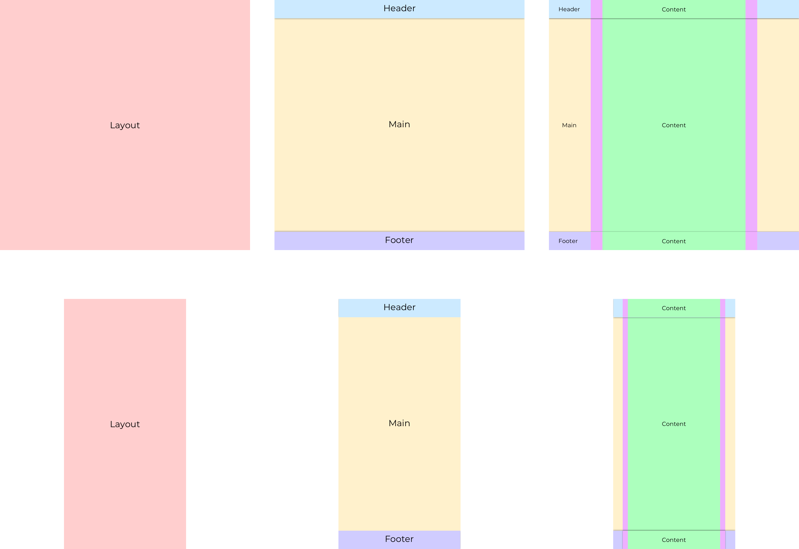

# Styled Components Media

This is an addon to styled-components to facilitate the layout of normal, centered websites. More specifically it mainly eases the management of the responsiveness and padding of the main content of the page.

_**OBS!**_
- _**This package is closely related to `@schlagerkhan/styled-components-media`. You might want to read it's documentation before getting into this.**_
- _**This package injects some properties into the styled-components default export. See more below.**_

# Installation

```bash
npm install @schlagerkhan/styled-components-layout
```
or
```bash
yarn add @schlagerkhan/styled-components-layout
```

# Usage

```jsx
import styled from 'styled-components';
import { LayoutThemeProvider } from '@schlagerkhan/styled-components-layout';

const Layout = styled.Layout``;

const Header = styled.header``;

const Main = styled.Main``;

const Content = styled.Content``;

const Footer = styled.footer``;

export const App = () => (
	<LayoutThemeProvider>
		<Layout>
			<Header>
				<Content>
					Header
				</Content>
			</Header>
			<Main>
				<Content>
					This is the content
				</Content>
			</Main>
			<Footer>
				<Content>
					Footer
				</Content>
		</Layout>
	</LayoutThemeProvider>
);
```

## Components
The components have to be used in a specific hiearchy in order to work correctly. A model of them can be seen in the image below:

1. `Layout`
	- Fills the entire page
2. `Header`, `Main`, `Footer`
	- `Header` and `Footer` are not provided by this library
	- `Main` fills the space that is not occupied by header of footer.
3. `Content`
	- Is centered by `margin-left/right: auto`
	- Has a responsive max width defined by the `LayoutThemeProvider``
	- Has a responsive padding defined in the same way.



Every level-2-component (middle component above) that needs centered content can use the `Content` as a direct child (as in the code example above).

## API
The package exposes the following modules/components:

## LayoutThemeProvider
Extends the `MediaThemeProvider` from `@schlagerkhan/styled-components-media` which adds a default theme containing:
- `media` - The object which upon which the responsiveness is based.
- `contentMediaMaxWidths` - An object of max-widths corresponding to the (or some of the) media-widths.
- `contentMediaPaddings`- The object of paddings corresponding to the (or some of the) media-widths

## DEFAULT_CONTENT_MAX_WIDTHS
- `initial: 425`

- `tablet: 600`
- `laptop: 1024`

Gives a the following max-widths for the specified viewports:
- viewport < tablet: `max-width: 425px`
- tablet <= viewport < laptop: `max-width: 600px`
- laptop <= viewport: `max-width: 1024px`

## DEFAULT_CONTENT_MEDIA_PADDINGS
- `initial: 16px`
- `tablet: 24px`
- `laptop: 48px`

Give paddings in the same manner as for the max-widths

## Layout
This component should be as close to the root as possible. Fills up the entire page.

It renders as a `article` html tag.

`Layout`, as all the react components exposed by this package, are injected into the styled-components default export object. This means that you don't have to explicitly import the components when you want to use them, you can use them such as:

```js
const Layout = styled.Layout`...`;
const Main = styled.Main`...`;
const Content = styled.Content`...`;
```

## Main
This component should be siblings with the header and the footer. It also have to be a child of the `Layout` component.

It fills up the space not occupied by any other sibling component.

It renders as a `main` html tag.

## Content
This component is where the magic happens. It is centered using the `margin-left/right: auto`. Also, with the help of `max/minMedia` from the `@schlagerkhan/styled-component-media` project and the objects defined by the `LayoutThemeProvider` it creates a responsive component that updates it's `max-width` and horizontal paddings depending on the current viewport.

In this way you can always use the `Content` tag to center your content in the same way all across your application.

It renders as a `div` html tag.

# Contribute
Pull requests are welcome.

# License

[MIT](https://choosealicense.com/licenses/mit/)
